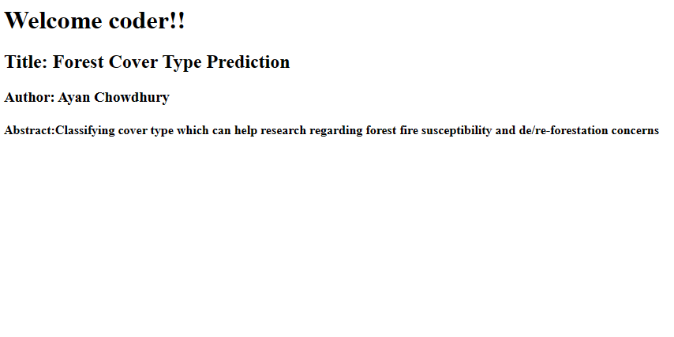
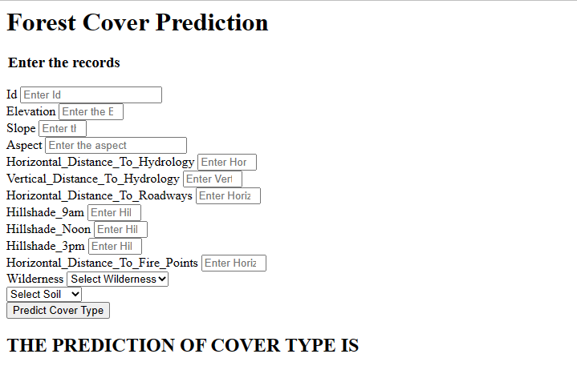

## Classifying cover type which can help research regarding forest fire susceptibility and de/re-forestation concerns.
Understanding forest composition is a valuable aspect of managing the health and vitality of our wilderness areas. 
Independent variables were derived from data originally obtained from US Geological Survey (USGS) and USFS data. 
Data is in raw form (not scaled) and contains binary (0 or 1) columns of data for qualitative independent variables (wilderness areas and soil types).

## Summary Statistics
1. Number of instances (observations)	581012
2. Number of Attributes	54
3. Attribute breakdown	12 measures, but 54 columns of data (10 quantitative variables, 4 binary wilderness areas and 40 binary soil type variables)
4. Missing Attribute Values	None
5. Variable Information

Given is the variable name, variable type, the measurement unit and a brief description. The forest cover type is the classification problem. The order of this listing corresponds to the order of numerals along the rows of the database.

### Code Designations

### Wilderness Areas:  	
    1 -- Rawah Wilderness Area
    2 -- Neota Wilderness Area
    3 -- Comanche Peak Wilderness Area
    4 -- Cache la Poudre Wilderness Area

### Soil Types:		
    1 to 40 : based on the USFS Ecological Landtype Units for this study area.

### Forest Cover Types:	
    1 -- Spruce/Fir
    2 -- Lodgepole Pine
    3 -- Ponderosa Pine
    4 -- Cottonwood/Willow
    5 -- Aspen
    6 -- Douglas-fir
    7 -- Krummholz
    
### Class Distribution

Number of records of Spruce-Fir: 	211840 
Number of records of Lodgepole Pine: 	283301 
Number of records of Ponderosa Pine: 	 35754 
Number of records of Cottonwood/Willow:   2747 
Number of records of Aspen: 		  9493 
Number of records of Douglas-fir: 	 17367 
Number of records of Krummholz: 	 20510 	
Number of records of other: 		     0 	
		
Total records:				581012

Steps Involved:
1. Data Ingestion from DB
2. EDA and feature Engg
3. Data Pipeline for data preprocessing
4. Split data and store in artifacts folder
5. Data Transformation and preprocessing 
6. Model trainer 
7. Validation of data
8. Best model seleted 
9. Prediction pipeline
10. App.py file for route GET/POST
11. Deployment in Azure/AWS 

Technology Hacks

* Front End: HTML
* Backend: Python
* DataBase: Cassandra (DataStax Atlas)
* Deployment: AWS ElasticBeanStalk

